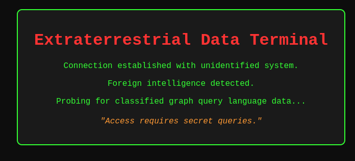

# Graph Map 1
## Presentation
You are presented with a website

## Solving
"graph query languauge" should hint that the website has some kind of GraphQL running.
- Go to the url:port/graphql
- See that introspection is disabled
- Use a tool that obtais the schema even if the introspection is disabled, e.g. [Clairvoyance](https://github.com/nikitastupin/clairvoyance)
- Obtain the schema using Clairvoyance tool with `clairvoyance url:4000/graphql -o schema.json`
- Look through `schema.json` and see that there is a query name for `secretQuery`
- Make a POST request using cURL with `curl -X POST url:port/graphql -H "Content-Type: application/json" -d '{"query": "{ secretQuery }"}'`